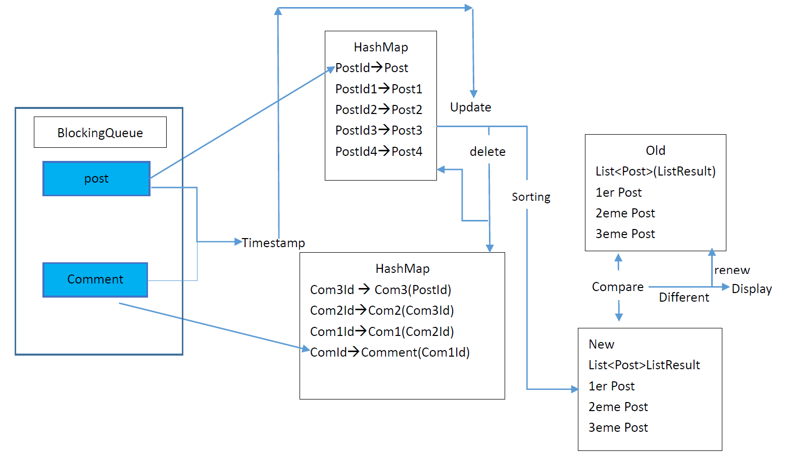
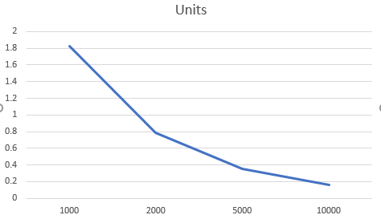
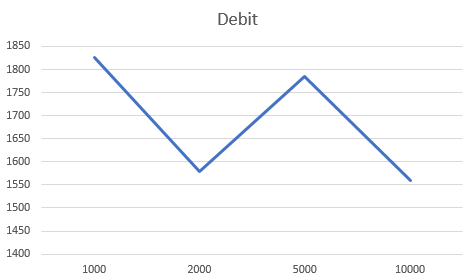

# [TSE] FISE2 Project High Performance Computing

## Project Description:

The underlying scenario addresses the analysis metrics for a dynamic (evolving) social-network graph. Specifically, the 2016 Grand Challenge targets following problems: identification of the posts that currently trigger the most activity in the social network. The corresponding queries require continuous analysis of a dynamic graph under the consideration of multiple streams that reflect updates to the graph.

more information on : [DEBS 2016](http://www.ics.uci.edu/~debs2016/call-grand-challenge.html)

## Project Structure:

### Data Structure:
Here's the class diagram for the base data structure:


### Producer Schema:


### Consumer Schema:



## JUnit Test:

### Test Data Modification:
For passing the simple tests, we have to modify some records in the `_expectedQ1.txt` to let the test data follow the same output strategy:
1. A new output record should be confirmed that the new order of top 3 is different from the previous one.(Just for order not include parameters changed like `Score` and `Commenters`)
2. We didn't consider the situation of clearing the `HashMap` when there isn't new input event any more.(A new output record should be based on the timestamp of the new input event)

#### Example 1:

In Test `Q1CommentCount`:

>2010-02-01T05:12:32.921+0000,1039993,Lei Liu,10,0,-,-,-,-,-,-,-,-  
~~2010-02-08T04:05:20.777+0000,1039993,Lei Liu,14,1,-,-,-,-,-,-,-,-~~  
~~2010-02-14T07:15:06.967+0000,1039993,Lei Liu,14,2,-,-,-,-,-,-,-,-~~  
~~2010-02-18T08:12:06.616+0000,1039993,Lei Liu,16,2,-,-,-,-,-,-,-,-~~  
~~2010-02-19T04:05:20.777+0000,1039993,Lei Liu,26,3,-,-,-,-,-,-,-,-~~  
~~2010-02-19T07:16:06.967+0000,1039993,Lei Liu,35,3,-,-,-,-,-,-,-,-~~  
2010-03-01T07:16:06.967+0000,-,-,-,-,-,-,-,-,-,-,-,-  


#### Example 2:

In Test `Q1Case1`:

>2010-03-21T00:01:01.943+0000,1,Tissa Perera,10,0,-,-,-,-,-,-,-,-  
2010-03-22T00:01:01.943+0000,2,Tissa Perera,10,0,1,Tissa Perera,9,0,-,-,-,-  
2010-03-23T00:01:01.943+0000,3,Tissa Perera,10,0,2,Tissa Perera,9,0,1,Tissa Perera,8,0  
2010-03-24T00:01:01.943+0000,4,Tissa Perera,10,0,3,Tissa Perera,9,0,2,Tissa Perera,8,0  
2010-03-25T00:01:01.943+0000,5,Tissa Perera,10,0,4,Tissa Perera,9,0,3,Tissa Perera,8,0  
~~2010-04-02T00:01:01.943+0000,5,Tissa Perera,2,0,4,Tissa Perera,1,0,-,-,-,-~~<br/>
~~2010-04-03T00:01:01.943+0000,5,Tissa Perera,1,0,-,-,-,-,-,-,-,-~~<br/>
~~2010-04-04T00:01:01.943+0000,-,-,-,-,-,-,-,-,-,-,-,-~~<br/>

### JUnit Test Result:

#### Q1Basic:

```
Expected: 2010-02-01T05:12:32.921+0000,1039993,Lei Liu,10,0,-,-,-,-,-,-,-,-
Actual:   2010-02-01T05:12:32.921+0000,1039993,Lei Liu,10,0,-,-,-,-,-,-,-,-
Expected: 2010-02-02T19:53:43.226+0000,299101,Michael Wang,10,0,1039993,Lei Liu,9,0,-,-,-,-
Actual:   2010-02-02T19:53:43.226+0000,299101,Michael Wang,10,0,1039993,Lei Liu,9,0,-,-,-,-
Expected: 2010-02-09T04:05:10.421+0000,529360,Wei Zhu,10,0,299101,Michael Wang,4,0,1039993,Lei Liu,3,0
Actual:   2010-02-09T04:05:10.421+0000,529360,Wei Zhu,10,0,299101,Michael Wang,4,0,1039993,Lei Liu,3,0
```

#### Q1Basic2:

```
Expected: 2010-02-01T05:12:32.921+0000,1039993,Lei Liu,10,0,-,-,-,-,-,-,-,-
Actual:   2010-02-01T05:12:32.921+0000,1039993,Lei Liu,10,0,-,-,-,-,-,-,-,-
Expected: 2010-02-02T19:53:43.226+0000,299101,Michael Wang,10,0,1039993,Lei Liu,9,0,-,-,-,-
Actual:   2010-02-02T19:53:43.226+0000,299101,Michael Wang,10,0,1039993,Lei Liu,9,0,-,-,-,-
Expected: 2010-02-09T04:05:10.421+0000,529360,Wei Zhu,10,0,299101,Michael Wang,4,0,1039993,Lei Liu,3,0
Actual:   2010-02-09T04:05:10.421+0000,529360,Wei Zhu,10,0,299101,Michael Wang,4,0,1039993,Lei Liu,3,0
Expected: 2010-02-10T04:05:20.777+0000,1039993,Lei Liu,12,1,529360,Wei Zhu,9,0,299101,Michael Wang,3,0
Actual:   2010-02-10T04:05:20.777+0000,1039993,Lei Liu,12,1,529360,Wei Zhu,9,0,299101,Michael Wang,3,0
```

#### Q1BigTest:

```
Expected: 2010-02-09T04:05:10.421+0000,529360,Wei Zhu,10,0,-,-,-,-,-,-,-,-
Actual:   2010-02-09T04:05:10.421+0000,529360,Wei Zhu,10,0,-,-,-,-,-,-,-,-
Expected: 2010-02-09T16:21:23.008+0000,529360,Wei Zhu,80,2,1076792,Richard Richter,10,0,-,-,-,-
Actual:   2010-02-09T16:21:23.008+0000,529360,Wei Zhu,80,2,1076792,Richard Richter,10,0,-,-,-,-
Expected: 2010-02-11T12:01:34.646+0000,529360,Wei Zhu,64,2,1301393,Wei Zhou,10,0,1076792,Richard Richter,9,0
Actual:   2010-02-11T12:01:34.646+0000,529360,Wei Zhu,64,2,1301393,Wei Zhou,10,0,1076792,Richard Richter,9,0
Expected: 2010-02-11T19:23:25.459+0000,529360,Wei Zhu,64,2,299390,Michael Wang,10,0,1301393,Wei Zhou,10,0
Actual:   2010-02-11T19:23:25.459+0000,529360,Wei Zhu,64,2,299390,Michael Wang,10,0,1301393,Wei Zhou,10,0
Expected: 2010-02-11T19:23:26.459+0000,529360,Wei Zhu,64,2,299391,Michael Wang,10,0,299390,Michael Wang,10,0
Actual:   2010-02-11T19:23:26.459+0000,529360,Wei Zhu,64,2,299391,Michael Wang,10,0,299390,Michael Wang,10,0
Expected: 2010-02-11T19:23:27.459+0000,529360,Wei Zhu,64,2,299392,Michael Wang,10,0,299391,Michael Wang,10,0
Actual:   2010-02-11T19:23:27.459+0000,529360,Wei Zhu,64,2,299392,Michael Wang,10,0,299391,Michael Wang,10,0
Expected: 2010-02-11T19:23:28.459+0000,529360,Wei Zhu,64,2,299393,Michael Wang,10,0,299392,Michael Wang,10,0
Actual:   2010-02-11T19:23:28.459+0000,529360,Wei Zhu,64,2,299393,Michael Wang,10,0,299392,Michael Wang,10,0
Expected: 2010-02-11T19:23:29.459+0000,529360,Wei Zhu,64,2,299394,Michael Wang,10,0,299393,Michael Wang,10,0
Actual:   2010-02-11T19:23:29.459+0000,529360,Wei Zhu,64,2,299394,Michael Wang,10,0,299393,Michael Wang,10,0
Expected: 2010-02-11T19:23:30.459+0000,529360,Wei Zhu,64,2,299395,Michael Wang,10,0,299394,Michael Wang,10,0
Actual:   2010-02-11T19:23:30.459+0000,529360,Wei Zhu,64,2,299395,Michael Wang,10,0,299394,Michael Wang,10,0
Expected: 2010-02-12T10:37:40.873+0000,529360,Wei Zhu,56,2,798675,Peter Schmidt,10,0,299395,Michael Wang,10,0
Actual:   2010-02-12T10:37:40.873+0000,529360,Wei Zhu,56,2,798675,Peter Schmidt,10,0,299395,Michael Wang,10,0
Expected: 2010-02-12T18:19:04.855+0000,529360,Wei Zhu,56,2,701070,Emperor of Brazil Silva,10,0,798675,Peter Schmidt,10,0
Actual:   2010-02-12T18:19:04.855+0000,529360,Wei Zhu,56,2,701070,Emperor of Brazil Silva,10,0,798675,Peter Schmidt,10,0
Expected: 2010-02-12T22:05:25.252+0000,701070,Emperor of Brazil Silva,60,2,529360,Wei Zhu,56,2,798675,Peter Schmidt,10,0
Actual:   2010-02-12T22:05:25.252+0000,701070,Emperor of Brazil Silva,60,2,529360,Wei Zhu,56,2,798675,Peter Schmidt,10,0
Expected: 2010-02-13T01:54:47.702+0000,701070,Emperor of Brazil Silva,70,2,529360,Wei Zhu,56,2,705054,Jun Lu,10,0
Actual:   2010-02-13T01:54:47.702+0000,701070,Emperor of Brazil Silva,70,2,529360,Wei Zhu,56,2,705054,Jun Lu,10,0
Expected: 2010-02-16T06:18:31.926+0000,701070,Emperor of Brazil Silva,81,2,529360,Wei Zhu,27,2,571477,Jharana Bajracharya Rashid Shrestha,10,0
Actual:   2010-02-16T06:18:31.926+0000,701070,Emperor of Brazil Silva,81,2,529360,Wei Zhu,27,2,571477,Jharana Bajracharya Rashid Shrestha,10,0
```

#### Q1Case1:

```
Expected: 2010-03-21T00:01:01.943+0000,1,Tissa Perera,10,0,-,-,-,-,-,-,-,-
Actual:   2010-03-21T00:01:01.943+0000,1,Tissa Perera,10,0,-,-,-,-,-,-,-,-
Expected: 2010-03-22T00:01:01.943+0000,2,Tissa Perera,10,0,1,Tissa Perera,9,0,-,-,-,-
Actual:   2010-03-22T00:01:01.943+0000,2,Tissa Perera,10,0,1,Tissa Perera,9,0,-,-,-,-
Expected: 2010-03-23T00:01:01.943+0000,3,Tissa Perera,10,0,2,Tissa Perera,9,0,1,Tissa Perera,8,0
Actual:   2010-03-23T00:01:01.943+0000,3,Tissa Perera,10,0,2,Tissa Perera,9,0,1,Tissa Perera,8,0
Expected: 2010-03-24T00:01:01.943+0000,4,Tissa Perera,10,0,3,Tissa Perera,9,0,2,Tissa Perera,8,0
Actual:   2010-03-24T00:01:01.943+0000,4,Tissa Perera,10,0,3,Tissa Perera,9,0,2,Tissa Perera,8,0
Expected: 2010-03-25T00:01:01.943+0000,5,Tissa Perera,10,0,4,Tissa Perera,9,0,3,Tissa Perera,8,0
Actual:   2010-03-25T00:01:01.943+0000,5,Tissa Perera,10,0,4,Tissa Perera,9,0,3,Tissa Perera,8,0
```

#### Q1Case2:

```
Expected: 2010-04-21T00:01:01.943+0000,6,A B,10,0,-,-,-,-,-,-,-,-
Actual:   2010-04-21T00:01:01.943+0000,6,A B,10,0,-,-,-,-,-,-,-,-
Expected: 2010-05-01T00:01:01.943+0000,7,A B,10,0,-,-,-,-,-,-,-,-
Actual:   2010-05-01T00:01:01.943+0000,7,A B,10,0,-,-,-,-,-,-,-,-
Expected: 2010-05-11T00:01:01.943+0000,8,A B,10,0,-,-,-,-,-,-,-,-
Actual:   2010-05-11T00:01:01.943+0000,8,A B,10,0,-,-,-,-,-,-,-,-
Expected: 2010-05-21T00:01:01.943+0000,9,A B,10,0,-,-,-,-,-,-,-,-
Actual:   2010-05-21T00:01:01.943+0000,9,A B,10,0,-,-,-,-,-,-,-,-
Expected: 2010-05-31T00:01:01.943+0000,10,A B,10,0,-,-,-,-,-,-,-,-
Actual:   2010-05-31T00:01:01.943+0000,10,A B,10,0,-,-,-,-,-,-,-,-
```

#### Q1Case3:

```
Expected: 2010-07-01T00:01:01.943+0000,11,C D,10,0,-,-,-,-,-,-,-,-
Actual:   2010-07-01T00:01:01.943+0000,11,C D,10,0,-,-,-,-,-,-,-,-
Expected: 2010-07-01T00:01:01.943+0000,17,D F,10,0,11,C D,10,0,-,-,-,-
Actual:   2010-07-01T00:01:01.943+0000,17,D F,10,0,11,C D,10,0,-,-,-,-
Expected: 2010-07-01T00:01:01.943+0000,11,C D,20,1,17,D F,10,0,-,-,-,-
Actual:   2010-07-01T00:01:01.943+0000,11,C D,20,1,17,D F,10,0,-,-,-,-
Expected: 2010-07-02T00:01:01.943+0000,17,D F,29,2,11,C D,27,2,-,-,-,-
Actual:   2010-07-02T00:01:01.943+0000,17,D F,29,2,11,C D,27,2,-,-,-,-
Expected: 2010-07-03T00:01:01.943+0000,11,C D,34,3,17,D F,26,2,-,-,-,-
Actual:   2010-07-03T00:01:01.943+0000,11,C D,34,3,17,D F,26,2,-,-,-,-
Expected: 2010-07-04T00:01:01.943+0000,17,D F,43,4,11,C D,39,4,-,-,-,-
Actual:   2010-07-04T00:01:01.943+0000,17,D F,43,4,11,C D,39,4,-,-,-,-
Expected: 2010-07-05T00:01:01.943+0000,11,C D,44,5,17,D F,38,4,-,-,-,-
Actual:   2010-07-05T00:01:01.943+0000,11,C D,44,5,17,D F,38,4,-,-,-,-
```

#### Q1Case4:

```
Expected: 2010-08-21T00:01:01.943+0000,12,Tissa Perera,10,0,-,-,-,-,-,-,-,-
Actual:   2010-08-21T00:01:01.943+0000,12,Tissa Perera,10,0,-,-,-,-,-,-,-,-
Expected: 2010-08-22T00:01:01.943+0000,13,Tissa Perera,10,0,12,Tissa Perera,9,0,-,-,-,-
Actual:   2010-08-22T00:01:01.943+0000,13,Tissa Perera,10,0,12,Tissa Perera,9,0,-,-,-,-
Expected: 2010-08-23T00:01:01.943+0000,14,Tissa Perera,10,0,13,Tissa Perera,9,0,12,Tissa Perera,8,0
Actual:   2010-08-23T00:01:01.943+0000,14,Tissa Perera,10,0,13,Tissa Perera,9,0,12,Tissa Perera,8,0
Expected: 2010-08-23T00:03:01.943+0000,14,Tissa Perera,30,1,12,Tissa Perera,18,1,13,Tissa Perera,9,0
Actual:   2010-08-23T00:03:01.943+0000,14,Tissa Perera,30,1,12,Tissa Perera,18,1,13,Tissa Perera,9,0
```

#### Q1Case5:

```
Expected: 2010-09-15T00:01:01.943+0000,15,C D,10,0,-,-,-,-,-,-,-,-
Actual:   2010-09-15T00:01:01.943+0000,15,C D,10,0,-,-,-,-,-,-,-,-
Expected: 2010-09-15T00:01:01.943+0000,16,C D,10,0,15,C D,10,0,-,-,-,-
Actual:   2010-09-15T00:01:01.943+0000,16,C D,10,0,15,C D,10,0,-,-,-,-
Expected: 2010-10-23T00:03:01.943+0000,-,-,-,-,-,-,-,-,-,-,-,-
Actual:   2010-10-23T00:03:01.943+0000,-,-,-,-,-,-,-,-,-,-,-,-
```

#### Q1CommentCount:

```
Expected: 2010-02-01T05:12:32.921+0000,1039993,Lei Liu,10,0,-,-,-,-,-,-,-,-
Actual:   2010-02-01T05:12:32.921+0000,1039993,Lei Liu,10,0,-,-,-,-,-,-,-,-
Expected: 2010-03-01T07:16:06.967+0000,-,-,-,-,-,-,-,-,-,-,-,-
Actual:   2010-03-01T07:16:06.967+0000,-,-,-,-,-,-,-,-,-,-,-,-
```

#### Q1PostExpiredComment:

```
Expected: 2010-02-01T05:12:32.921+0000,1039993,Lei Liu,10,0,-,-,-,-,-,-,-,-
Actual:   2010-02-01T05:12:32.921+0000,1039993,Lei Liu,10,0,-,-,-,-,-,-,-,-
Expected: 2010-02-12T04:05:20.777+0000,-,-,-,-,-,-,-,-,-,-,-,-
Actual:   2010-02-12T04:05:20.777+0000,-,-,-,-,-,-,-,-,-,-,-,-
```

#### Q1PostExpiredComment2:

```
Expected: 2010-02-01T05:12:32.921+0000,1039993,Lei Liu,10,0,-,-,-,-,-,-,-,-
Actual:   2010-02-01T05:12:32.921+0000,1039993,Lei Liu,10,0,-,-,-,-,-,-,-,-
Expected: 2010-02-12T19:53:43.226+0000,299101,Michael Wang,10,0,1039993,Lei Liu,1,1,-,-,-,-
Actual:   2010-02-12T19:53:43.226+0000,299101,Michael Wang,10,0,1039993,Lei Liu,1,1,-,-,-,-
Expected: 2010-02-23T04:05:10.421+0000,529360,Wei Zhu,10,0,-,-,-,-,-,-,-,-
Actual:   2010-02-23T04:05:10.421+0000,529360,Wei Zhu,10,0,-,-,-,-,-,-,-,-
```

## JMH Benchmark Test:

### N-Records Test Results:

Here's the result on the machine ThinkPad-X1(I7-4600U @2.7GHz, 8GB RAM @1600MHz):<br/>

```
# Run complete. Total time: 00:02:33

Benchmark                          (arg)   Mode  Samples    Score  Score error  Units
t.t.h.TestBenchmark_Sample.test      100  thrpt        5  232.462       43.227  ops/s
t.t.h.TestBenchmark_Sample.test     1000  thrpt        5    1.826        0.138  ops/s
t.t.h.TestBenchmark_Sample.test     2000  thrpt        5    0.789        0.032  ops/s
t.t.h.TestBenchmark_Sample.test     5000  thrpt        5    0.357        0.010  ops/s
t.t.h.TestBenchmark_Sample.test    10000  thrpt        5    0.156        0.008  ops/s
```
`arg` means the amount of records in both `post` and `comment` files.<br/>
`Score` means the number of operations could run in 1s.<br/>

<figure class="double">
    
    
</figure>

According to the debit, we suppose that the average debit in [1650, 1700]<br/>
588,652 / 1675 = 351.43s (5.86 mins) for 100MB data.<br/>
3.53GB / 100MB = 36.1472<br/>
36.1472 * 5.86 mins = 211.82 mins (3h32mins)

### 100MB Data Test:

Here's a result of *100MB* data test: (Unfinished)

```
# VM invoker: C:\Program Files\Java\jdk1.8.0_102\jre\bin\java.exe
# VM options: -javaagent:D:\Outils\JetBrains\IntelliJ IDEA Community Edition 2017.1\lib\idea_rt.jar=51866:D:\Outils\JetBrains\IntelliJ IDEA Community Edition 2017.1\bin -Dfile.encoding=UTF-8
# Warmup: 5 iterations, 1 s each
# Measurement: 5 iterations, 1 s each
# Threads: 1 thread, will synchronize iterations
# Benchmark mode: Average time, time/op
# Benchmark: team.tse.hpp.TestBenchmark_100MB.test

# Run progress: 0.00% complete, ETA 00:00:10
# Fork: 1 of 1
# Warmup Iteration   1: 5700.732 s/op
# Warmup Iteration   2: 4713.467 s/op
# Warmup Iteration   3: 4290.647 s/op
# Warmup Iteration   4: 
Process finished with exit code 1
```

By the result of the test, we found that the actual situation isn't the same as we expected while running 100MB (35.3MB for post and 81.5MB for comment 116.8MB total).<br/>
For running this 100MB test, we need at least `4290.647 s (1h 12mins) >> 5.86 mins(by calculation)`.
